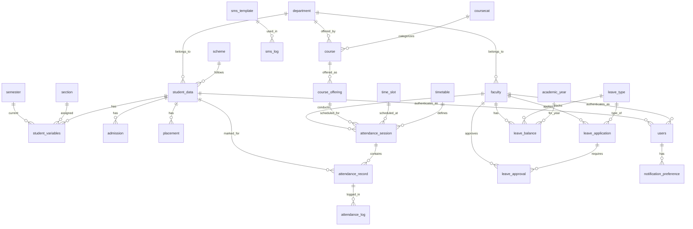

# MRIT Hub - Complete Database Schema & ERD

## 📊 Database Overview

**Database**: PostgreSQL 15  
**Total Tables**: 34  
**Schema Version**: v3.0 (with Leave Management)  
**Last Updated**: December 2025  

## 🗄️ Table Categories

### 1. Core Master Data (10 tables)
- `department` - Academic departments (CSE, ECE, ME, etc.)
- `scheme` - Academic schemes (2015, 2017, 2018, 2021, 2022)
- `semester` - Semester definitions (1-8)
- `section` - Section definitions (A, B, C, D)
- `academic_year` - Academic year tracking
- `financial_year` - Financial year tracking
- `batch` - Student batch information
- `gender` - Gender master data
- `reservation` - Reservation categories
- `entry` - Entry type classifications

### 2. Student Management (4 tables)
- `student_data` - Core student information
- `student_variables` - Dynamic student attributes
- `admission` - Admission details
- `placement` - Placement tracking

### 3. Faculty & Staff (2 tables)
- `faculty` - Faculty information and roles
- `users` - Authentication and user management

### 4. Academic Structure (4 tables)
- `course` - Course definitions
- `coursecat` - Course categories
- `course_offering` - Course offerings per semester
- `exam_type` - Examination type definitions

### 5. Attendance Management (6 tables)
- `attendance_session` - Class sessions
- `attendance_record` - Individual attendance records
- `attendance_log` - Audit trail for changes
- `attendance_summary` - Aggregated attendance data
- `time_slot` - Time slot definitions
- `timetable` - Class scheduling

### 6. Leave Management (4 tables) - Faculty & Staff Only
- `leave_type` - Leave type configurations
- `leave_balance` - Faculty/staff leave balances
- `leave_application` - Faculty/staff leave requests
- `leave_approval` - Approval workflow tracking

### 7. Communication & Notifications (3 tables)
- `sms_template` - SMS message templates
- `sms_log` - SMS delivery tracking
- `notification_preference` - User notification settings

### 8. Graduation Tracking (1 table)
- `grad_year` - Graduation year tracking

## 🔗 Entity Relationship Diagram



## 📋 Detailed Table Specifications

### Core Master Tables

#### department
```sql
id (PK) | department_name | department_code | active | created_at
1       | Computer Science| CSE            | true   | 2025-01-01
2       | Electronics     | ECE            | true   | 2025-01-01
```

#### student_data
```sql
id (PK) | usn        | student_name | branch_id (FK) | scheme_id (FK) | active
1       | 1MS21CS001 | John Doe     | 1              | 4              | true
2       | 1MS21CS002 | Jane Smith   | 1              | 4              | true
```

#### faculty
```sql
id (PK) | faculty_name | department_id (FK) | designation | active
1       | Dr. Smith    | 1                  | Professor   | true
2       | Prof. Jones  | 2                  | Asst Prof   | true
```

### Attendance Management Tables

#### attendance_session
```sql
id (PK) | faculty_id (FK) | session_date | time_slot_id (FK) | status | total_students
1       | 1               | 2025-01-15   | 1                 | open   | 60
2       | 2               | 2025-01-15   | 2                 | locked | 45
```

#### attendance_record
```sql
id (PK) | session_id (FK) | student_id (FK) | status | marked_by (FK) | marked_at
1       | 1               | 1               | P      | 1              | 2025-01-15 09:30
2       | 1               | 2               | A      | 1              | 2025-01-15 09:30
```

### Leave Management Tables

#### leave_type
```sql
id (PK) | name         | code | allow_half_day | requires_substitute | max_days_per_year
1       | Casual Leave | CL   | true           | true                | 12
2       | Earned Leave | EL   | true           | true                | 30
```

#### leave_application
```sql
id (PK) | faculty_id (FK) | leave_type_id (FK) | from_date  | to_date    | total_days | status
1       | 1               | 1                  | 2025-01-20 | 2025-01-21 | 2          | APPROVED
2       | 2               | 2                  | 2025-02-01 | 2025-02-05 | 5          | PENDING_HOD
```

## 🔑 Key Relationships

### Primary Foreign Key Relationships
1. **student_data.branch_id** → department.id
2. **student_variables.usn** → student_data.usn
3. **attendance_session.faculty_id** → faculty.id
4. **attendance_record.session_id** → attendance_session.id
5. **leave_application.faculty_id** → faculty.id
6. **leave_balance.faculty_id** → faculty.id
7. **users.student_id** → student_data.id
8. **users.faculty_id** → faculty.id

### Composite Keys & Unique Constraints
- `leave_balance`: UNIQUE(faculty_id, leave_type_id, academic_year_id)
- `student_variables`: UNIQUE(usn, semester_id, section_id)
- `leave_approval`: UNIQUE(leave_application_id, stage)

## 📊 Data Statistics (Current)

### Master Data
- **Departments**: 10 (CSE, ECE, ME, CE, etc.)
- **Academic Schemes**: 5 (2015, 2017, 2018, 2021, 2022)
- **Semesters**: 8 (1st to 8th)
- **Sections**: 4 (A, B, C, D)
- **Leave Types**: 9 (CL, SCL, EL, VL, OD, etc.)

### Transactional Data
- **Faculty Records**: 2+ active faculty
- **Student Records**: Sample data available
- **Time Slots**: 14 configured slots
- **Leave Balances**: 18 records (2 faculty/staff × 9 leave types)
- **Sample Applications**: 3 faculty leave applications in different stages

## 🔍 Database Indexes

### Performance Indexes
```sql
-- Attendance System
CREATE INDEX idx_attendance_session_faculty ON attendance_session(faculty_id);
CREATE INDEX idx_attendance_record_session_student ON attendance_record(session_id, student_id);
CREATE INDEX idx_attendance_session_date ON attendance_session(session_date);

-- Leave Management
CREATE INDEX idx_leave_balance_faculty ON leave_balance(faculty_id);
CREATE INDEX idx_leave_application_faculty ON leave_application(faculty_id);
CREATE INDEX idx_leave_application_status ON leave_application(status);
CREATE INDEX idx_leave_approval_approver ON leave_approval(approver_id);

-- User Management
CREATE INDEX idx_users_email ON users(email);
CREATE INDEX idx_users_role ON users(role);

-- Student Management
CREATE INDEX idx_student_data_branch ON student_data(branch_id);
CREATE INDEX idx_student_variables_usn ON student_variables(usn);
```

## 🛡️ Data Integrity Constraints

### Check Constraints
```sql
-- Leave Management
ALTER TABLE leave_application ADD CONSTRAINT valid_date_range 
CHECK (from_date <= to_date);

ALTER TABLE leave_application ADD CONSTRAINT min_leave_days 
CHECK (total_days >= 0.5);

-- Attendance
ALTER TABLE attendance_record ADD CONSTRAINT valid_status 
CHECK (status IN ('P', 'A', 'L', 'OD', 'M'));

-- Users
ALTER TABLE users ADD CONSTRAINT valid_role 
CHECK (role IN ('STUDENT', 'FACULTY', 'MENTOR', 'HOD', 'ADMIN'));
```

### Triggers
```sql
-- Auto-update timestamps
CREATE TRIGGER update_users_updated_at 
BEFORE UPDATE ON users FOR EACH ROW 
EXECUTE FUNCTION update_updated_at_column();

CREATE TRIGGER update_leave_application_updated_at 
BEFORE UPDATE ON leave_application FOR EACH ROW 
EXECUTE FUNCTION update_updated_at_column();
```

## 🔄 Migration History

### Schema Evolution
1. **v1.0** (Phase 0): Core 27 tables - Foundation schema
2. **v2.0** (Phase 2): +7 tables - Attendance management system
3. **v3.0** (Phase 3): +4 tables - Leave management system

### Migration Files
```
database/migrations/
├── 003-add-attendance-enums.sql      # Attendance status enums
├── 004-fix-attendance-tables.sql     # Attendance table fixes
├── 005-final-attendance-fix.sql      # Final attendance corrections
├── 006-add-timetable-structure.sql   # Timetable integration
├── 007-leave-management-schema.sql   # Leave management tables
├── 008-leave-seed-data.sql          # Leave seed data (initial)
└── 009-leave-seed-data-fixed.sql    # Leave seed data (corrected)
```

## 🧪 Database Verification Commands

### Table Count Verification
```bash
# Total tables
docker exec mrit-postgres psql -U mrit_admin -d mrit_hub -c "\dt" | wc -l

# Tables by category
docker exec mrit-postgres psql -U mrit_admin -d mrit_hub -c "
SELECT 
  CASE 
    WHEN table_name LIKE 'attendance_%' THEN 'Attendance'
    WHEN table_name LIKE 'leave_%' THEN 'Leave Management'
    WHEN table_name LIKE 'sms_%' THEN 'Communication'
    WHEN table_name IN ('student_data', 'student_variables', 'admission', 'placement') THEN 'Student'
    WHEN table_name IN ('faculty', 'users') THEN 'Faculty/Users'
    ELSE 'Master Data'
  END as category,
  COUNT(*) as table_count
FROM information_schema.tables 
WHERE table_schema = 'public' 
GROUP BY category;"
```

### Data Verification
```bash
# Core data counts
docker exec mrit-postgres psql -U mrit_admin -d mrit_hub -c "
SELECT 'Departments' as entity, COUNT(*) as count FROM department
UNION ALL SELECT 'Faculty', COUNT(*) FROM faculty
UNION ALL SELECT 'Leave Types', COUNT(*) FROM leave_type
UNION ALL SELECT 'Time Slots', COUNT(*) FROM time_slot
UNION ALL SELECT 'Leave Balances', COUNT(*) FROM leave_balance;"
```

## 📈 Performance Considerations

### Query Optimization
- **Indexed Lookups**: All foreign keys indexed
- **Composite Indexes**: Multi-column queries optimized
- **Partial Indexes**: Status-based filtering optimized

### Scalability Features
- **Partitioning Ready**: Date-based partitioning for attendance/leave logs
- **Archive Strategy**: Historical data archival capability
- **Connection Pooling**: Optimized for 200+ concurrent users

## 🔒 Security Features

### Access Control
- **Row-Level Security**: Faculty can only see their own data
- **Role-Based Access**: Different permissions per user role
- **Audit Logging**: All changes tracked in log tables

### Data Protection
- **Password Hashing**: bcrypt with salt rounds
- **Token Security**: JWT with expiration
- **SQL Injection Prevention**: Parameterized queries via TypeORM

---

**Schema Version**: v3.0  
**Last Updated**: December 2025  
**Total Tables**: 34  
**Status**: ✅ Production Ready